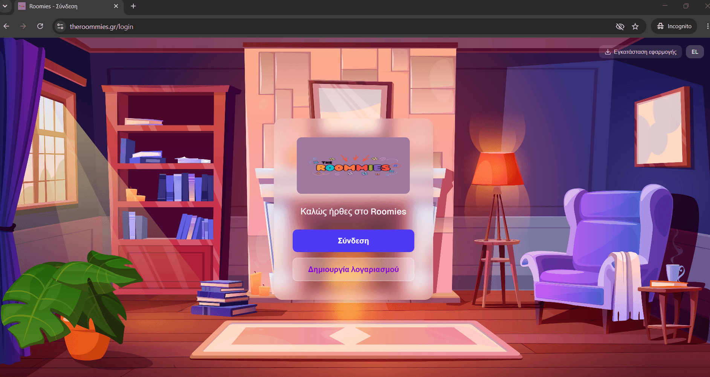
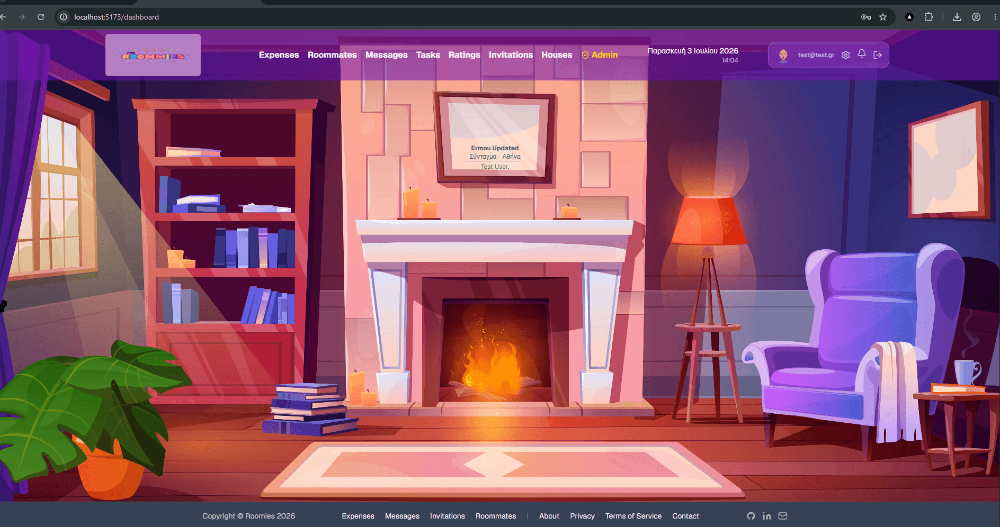
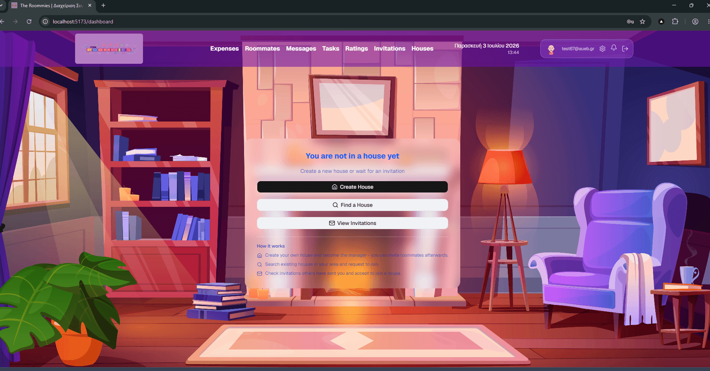

# 🏠 The Roommies | Frontend

A production-grade **co-living management platform** that helps roommates organize shared expenses, tasks, ratings, messaging, and house invitations. All in one place.

**🌐 Live:** [www.theroommies.gr](https://www.theroommies.gr)



---

## ✨ Overview

The Roommies is a full-stack, bilingual (Greek / English) Progressive Web App. This repository contains the **React frontend**, deployed on Azure Static Web Apps and backed by a Spring Boot API with Keycloak authentication.

The app is installable on mobile and desktop as a PWA, works offline for its shell, and ships with a security-first setup (strict CSP, HSTS, cookieless telemetry, httpOnly cookie auth).



---

## 🚀 Tech Stack

| Category | Technologies |
|----------|--------------|
| **Core** | React 19, TypeScript, Vite 8 |
| **Styling** | Tailwind CSS v4, shadcn/ui, Radix UI |
| **Auth** | Keycloak (PKCE + Authorization Code Flow) |
| **Data / HTTP** | Axios, `@stomp/stompjs` + SockJS (WebSocket) |
| **Forms & Validation** | React Hook Form, Zod |
| **Routing** | React Router v7 |
| **i18n** | react-i18next (el / en) |
| **PWA** | vite-plugin-pwa (Workbox) |
| **Telemetry** | Azure Application Insights (cookieless) |

---

## 🔑 Key Features

- **Expense management** - split shared costs, track who owes whom, mark as paid, time-decay weighted settlement
- **Task management** - assign, filter by status, due dates, overdue tracking
- **Ratings** - rate roommates with a half-life weighted scoring algorithm
- **Real-time messaging** - encrypted messages over WebSocket / STOMP
- **House invitations** - invite, accept, cancel flows
- **Admin dashboard** - house/roommate/expense/task management for administrators
- **Bilingual** - full Greek & English support with runtime language switching
- **Installable PWA** - add to home screen on Android / iOS, offline app shell

---

## 🏛️ Architecture Highlights

The frontend is built around a few deliberate design decisions:

**BFF (Backend-for-Frontend) auth pattern.** The frontend never talks to Keycloak directly for token handling. Authentication uses the Authorization Code Flow with PKCE, and the backend manages sessions via **httpOnly cookies**. No access tokens are ever stored in `localStorage`, eliminating a common XSS token-theft vector.

**Clean separation of concerns.** HTTP calls live in a dedicated `api/` layer (pure network functions), while business logic lives in `services/`. Components consume services, not raw HTTP, keeping data-fetching, transformation, and UI cleanly decoupled.

**Type-safe forms.** Every form is validated with Zod schemas wired into React Hook Form via `@hookform/resolvers`. Validation schemas are built as factory functions that accept the i18n `t()` function, so error messages are fully translatable.

**Real-time layer.** A STOMP-over-WebSocket connection delivers live notifications and messages. The service worker deliberately leaves WebSocket traffic untouched, so real-time features work seamlessly alongside PWA caching.

---

## 🔒 Security

Security was a first-class concern throughout:

- **Strict Content Security Policy** - `script-src 'self'` with no `unsafe-inline` / `unsafe-eval`; `worker-src` and `manifest-src` explicitly scoped
- **HSTS** - `max-age=31536000; includeSubDomains` → **Grade A** on [securityheaders.com](https://securityheaders.com)
- **httpOnly cookie auth** - no tokens in browser-accessible storage
- **Cookieless telemetry** - Application Insights configured without cookies (no consent banner needed, GDPR-friendly)
- **EU data residency** - all services hosted in the EU (Amsterdam) region
- **Additional headers** - `X-Content-Type-Options`, `Cross-Origin-Opener-Policy`, `Referrer-Policy`

---

## 📱 PWA

The app is a fully installable Progressive Web App:

- Web App Manifest with maskable icons (192 / 512) and Apple touch icon
- Service worker (Workbox via vite-plugin-pwa) with `autoUpdate`
- **App-shell caching only**. API and Keycloak requests are `NetworkOnly`, so users always see live data
- Custom install prompt (Android one-tap via `beforeinstallprompt`, iOS instructions fallback)

---

## 🛠️ Getting Started

### Prerequisites

- **Node.js** 20+ and npm
- A running instance of the Roomies backend API + Keycloak (see environment variables below)

### Installation

```bash
# Clone the repository
git clone https://github.com/grgks/roomies-frontend-React.git
cd roomies-frontend-React

# Install dependencies
npm install
```

### Environment Variables

Create a `.env` file in the project root (see `.env.example`):

```env
VITE_API_BASE_URL=https://your-api-url
VITE_KEYCLOAK_URL=https://your-keycloak-url
VITE_KEYCLOAK_REALM=roomies-realm
VITE_KEYCLOAK_CLIENT_ID=roomies-frontend
VITE_APPINSIGHTS_CONNECTION_STRING=your-app-insights-connection-string
```

### Available Scripts

```bash
npm run dev       # Start the dev server (http://localhost:5173)
npm run build     # Type-check and build for production
npm run preview   # Preview the production build locally
npm run lint      # Run ESLint
```

---

## 📂 Project Structure

```
src/
├── api/            # HTTP call functions (network layer only)
├── services/       # Business logic layer
├── components/     # Reusable UI components
├── pages/          # Route-level pages
├── hooks/          # Custom React hooks
├── schemas/        # Zod validation schemas
├── i18n/           # Translation files (el / en)
├── utils/          # Constants and helpers
└── lib/            # Third-party integrations (App Insights, etc.)
```

---

## 📸 Screenshots

### Login


### Dashboard - with house


### Dashboard - no house (empty state)


---

## 📄 License

This project is part of a personal portfolio. All rights reserved.

---

Built by [Giorgos Kounelis](https://github.com/grgks)